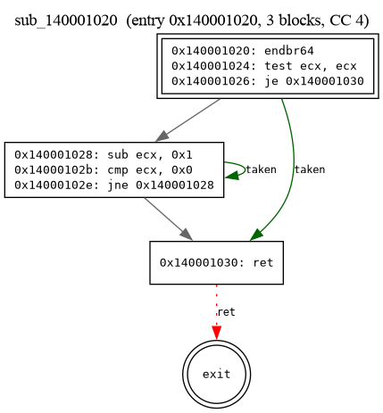
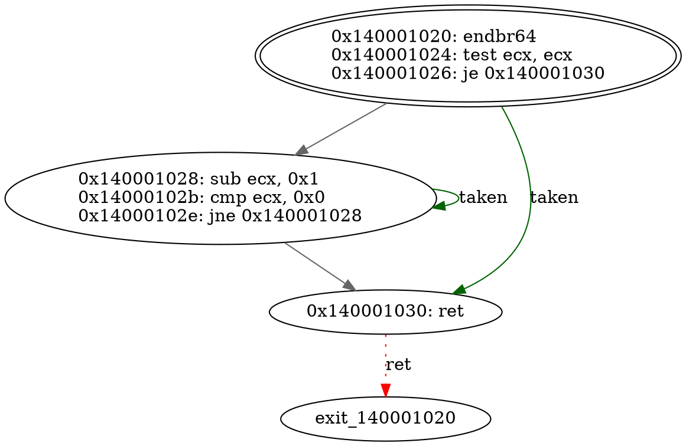

# vexis


vexis decodes x86-64 machine code by hand — legacy and REX prefixes, ModR/M,
SIB, RIP-relative addressing, and a real opcode map — with zero calls into
Capstone, Zydis, or any other disassembler. It turns that decode stream into
basic blocks, a typed control-flow graph, recovered functions, and
anti-disassembly findings, and it tells you precisely where its own coverage
runs out instead of quietly guessing.

Every prefix byte, every ModR/M encoding, every SIB and displacement
calculation is original code in `src/decoder/`. No third-party disassembler
touches the analysis path. `iced-x86` shows up exactly once, as a dev-only
differential-testing oracle used to check the decoder's output, never to
produce it (see [`docs/adr/0002`](docs/adr/0002-iced-x86-as-oracle.md)).

```
$ cargo run -- analyze samples/hello.exe --out out
wrote out/hello.json
wrote out/hello.md
wrote 2 DOT file(s) to out/hello.dot.d
  15 instructions, 5 blocks, 2 functions, 8 edges, 4 anti-disasm flag(s)
```

## Why this is hard

x86-64 instructions aren't fixed-width. A single instruction runs anywhere
from 1 to 15 bytes, built from an arbitrary stack of legacy prefixes
(segment overrides, operand-size overrides, `lock`, repeat prefixes that
double as SSE opcode selectors) topped with an optional REX byte that only
counts at all if it sits directly before the opcode. The same ModR/M byte
means something different depending on which prefixes came before it, and a
SIB byte on top of that can encode a base register, an index register, a
scale factor, and a RIP-relative displacement in one pass, sometimes with no
base register at all. Get any of that wrong and you don't just misdecode one
instruction — you lose sync with everything after it, because every
downstream boundary depends on the current instruction's length being
exactly right. Building a control-flow graph on top of that stream is its
own problem on top of the encoding problem: real binaries mix code and data
in the same section, pad function boundaries with `0xCC`/`0x90` runs, and
route through function pointers and jump tables that a naive linear sweep
will misread as straight-line code.

## What it does

| Stage | Module | Notes |
|-------|--------|-------|
| PE64 load | `pe/loader.rs` | headers, sections, entry point (via `goblin`, headers only) |
| Instruction decode | `decoder/` | REX / ModR/M / SIB / disp / imm; `mov lea push pop call jmp jcc xor test cmp add sub` + common SSE moves + terminators |
| Linear sweep | `disassembler/linear.rs` | decode back-to-back, skip 1 byte on failure |
| Recursive descent | `disassembler/recursive.rs` | explicit worklist + visited set ([ADR 0001](docs/adr/0001-worklist-over-pure-recursion.md)) |
| Basic blocks | `cfg/basic_block.rs` | leader detection on branch/call targets + fallthrough |
| CFG | `cfg/graph.rs` | `petgraph` digraph, typed edges: fallthrough / branch / call / return |
| Dominators | `cfg/dominator.rs` | Cooper–Harvey–Kennedy iterative algorithm |
| Function recovery | `analysis/function_recovery.rs` | prologue heuristics + call-target aggregation, first-seed-owns-block |
| Anti-disassembly | `analysis/anti_disasm.rs` | jump-into-instruction, overlapping regions, junk-byte padding |
| Stats | `stats/` | one `Stats` struct, computed once, consumed by every reporter |
| Reports | `report/` | JSON, Markdown, Graphviz DOT (one per function), batch summary |

## Install / build

```
cargo build --release
cargo test            # unit + differential (vs iced-x86) tests
```

Rust 1.98+ (2021 edition).

## Usage

```
# single binary -> out/<stem>.{json,md} + out/<stem>.dot.d/*.dot
cargo run -- analyze path/to/file.exe --out out

# pick a strategy
cargo run -- analyze file.exe --mode linear
cargo run -- analyze file.exe --mode recursive     # default

# only some formats
cargo run -- analyze file.exe --formats json,dot

# 50-binary corpus -> one aggregate summary.md + summary.json, sorted by max CC
cargo run -- batch ./samples --out out/batch
```

Render a function CFG:

```
dot -Tpng out/hello.dot.d/sub_140001020.dot -o cfg.png
```

## Example output

`samples/hello.exe` is generated by `cargo run --example make_sample` — a minimal
hand-built PE64 with two functions, a countdown loop, an `int3` padding run, and
a `jmp` into the middle of the following instruction as anti-disasm bait.

### Markdown report (excerpt)

Full file: [`docs/sample-report.md`](docs/sample-report.md).

```markdown
## Top-line stats

| Metric | Value |
|--------|-------|
| Instructions decoded | 15 |
| Basic blocks | 5 |
| CFG edges (total) | 8 |
| &nbsp;&nbsp;fallthrough | 3 |
| &nbsp;&nbsp;branch | 2 |
| &nbsp;&nbsp;call | 1 |
| &nbsp;&nbsp;return | 2 |
| Functions recovered | 2 |
| Max cyclomatic complexity | 4 |
| Anti-disassembly flags | 4 |

## Anti-disassembly findings

| Offset | Kind | Detail |
|--------|------|--------|
| 0x140001016 | JunkPadding | 10 x 0xcc filler bytes |
| 0x140001031 | JunkPadding | 15 x 0xcc filler bytes |
| 0x140001041 | JumpIntoInstruction | branch at 0x140001040 targets 0x140001041, interior of instruction at 0x140001040 |
| 0x140001044 | JunkPadding | 8 x 0xcc filler bytes |
```

### CFG (DOT render)

`sub_140001020`, the countdown loop — double-bordered entry block, green
taken-branch edges, the self-edge is the loop back-edge, red dotted edge to the
synthetic exit:





## Testing

* **Table tests** (`tests/instruction_tests.rs::table_tests`) — 36 curated
  encoding variants, one assertion each: exact mnemonic + operands + length.
* **Differential tests** — decode with our decoder and with `iced-x86`, compare.
  `random_bytes_length_agreement` runs 200,000 random 16-byte windows,
  106,527 of which decode to something both our decoder and the oracle
  accept, and currently reports **100.00% length agreement** (106,527/106,527)
  on that comparable set.
  `stats::accuracy` produces the `mnemonic_match_pct` / `length_match_pct`
  / mismatch-list report used in Markdown/JSON output.
* **Fuzzing** — `fuzz/fuzz_targets/{decode,linear_sweep}.rs` for `cargo-fuzz`.
  The decoder must never panic on arbitrary bytes and must always report a
  length in `1..=15` that does not overrun the input.

  ```
  cargo install cargo-fuzz
  cargo +nightly fuzz run decode -- -max_total_time=300
  ```

  Record crash-free run counts in [`docs/FUZZING.md`](docs/FUZZING.md).

## Frontend (optional) — CLI or GUI, your choice

`frontend/DisasmViewer` is an Avalonia/.NET MVVM GUI that wraps this CLI —
pick a binary, watch it get analyzed, browse the disassembly/CFG/stats/batch
results visually. It talks to the CLI over a process boundary (spawns it,
reads the JSON it writes), never links against the Rust core — see
[ADR 0005](docs/adr/0005-frontend-process-boundary.md).

The CLI and GUI are two separate executables. Use whichever fits:

```
# Pure CLI — scriptable, no GUI involved
target/release/x64-disasm-cfg analyze samples/hello.exe --out out

# GUI — pick a binary, click through the tabs
frontend/DisasmViewer/bin/Release/net10.0/.../DisasmViewer
```

`scripts/package.sh` builds both and drops them **into the same folder**, so
a user who just unzips a release build gets both for free with zero setup —
the GUI's `BackendLocator` checks for the CLI sitting next to it before
anything else:

```
scripts/package.sh                    # native host platform
scripts/package.sh linux-x64 win-x64  # cross-compiles the Rust side too,
                                       # where a target + linker is installed
scripts/package.sh --self-contained win-x64
```

```
dist/linux-x64/
  x64-disasm-cfg      <- run this directly for CLI/scripting use
  DisasmViewer         <- launch this for the GUI
  ...
```

## Scope

**In:** PE64, the opcode subset above, linear + recursive disassembly, basic
blocks, typed CFG, dominators, prologue/call function recovery, three
anti-disasm signals, JSON/Markdown/DOT + batch reports, differential + fuzz
testing.

**Out (MVP):** ELF, VEX/EVEX (AVX), data-flow / def-use analysis, indirect-branch
resolution via the IAT, any network or API calls.

## Decisions

- [ADR 0001 — Worklist over pure recursion](docs/adr/0001-worklist-over-pure-recursion.md)
- [ADR 0002 — iced-x86 as oracle only](docs/adr/0002-iced-x86-as-oracle.md)
- [ADR 0003 — PE64 first](docs/adr/0003-pe-first.md)
- [ADR 0004 — A decoder, not a wrapper](docs/adr/0004-decoder-not-wrapper.md)
- [ADR 0005 — Frontend talks to the backend over a process boundary](docs/adr/0005-frontend-process-boundary.md)

## License

MIT
